# Shringar - Jewelry Store App

Shringar is a collaborative full-stack jewelry store application. It is built using React, React Native, and Node.js with four distinct modules:
1. **Website** (React)
2. **Admin Panel** (React)
3. **Mobile App** (React Native)
4. **Backend** (Node.js, Private)

This repository specifically contains the **mobile app** build developed using **React Native CLI**.

## About the Project
The primary goal of Shringar is to provide a seamless jewelry shopping experience across web and mobile platforms. The project was developed collaboratively, where my specific responsibility was building the **mobile application**.

### Why React Native?
The choice of React Native was intentional:
- My teammate did not have prior experience with Android or Kotlin development.
- React Native ensured the codebase remained accessible and easy to understand for my partner.
- It also gave me an opportunity to learn React Native and enhance my skillset.

### Expo and CLI Builds
During development, we initially started with **Expo** but transitioned to **React Native CLI** midway. The reason for this shift was the need to integrate a **payment gateway**, which Expo's managed environment did not fully support at that time.

This repository contains the **CLI build** of the project.

## Features
The mobile app includes the following features:
- **User Authentication** (Login & Registration)
- **Product Categories**
- **Product Details**
- **Search and Filters**
- **Shopping Cart**
- **Order History**
- **Wishlist**
- **Payment Integration**

## Screenshots

<div style="display: flex; overflow-x: auto; gap: 10px;"> 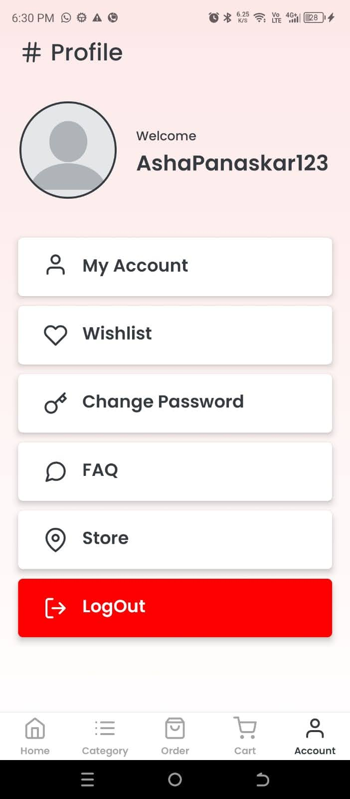 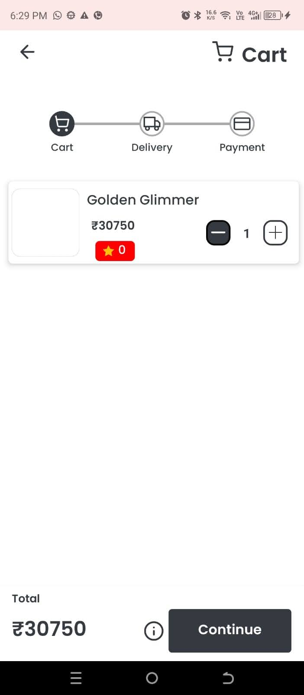 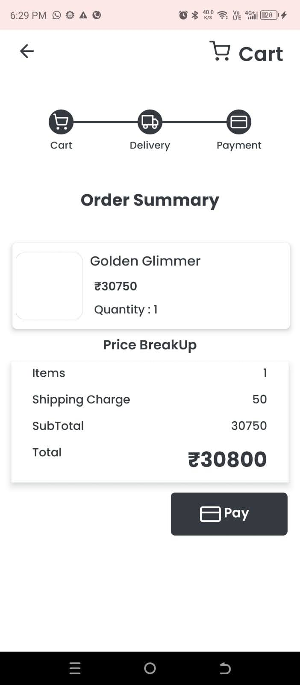 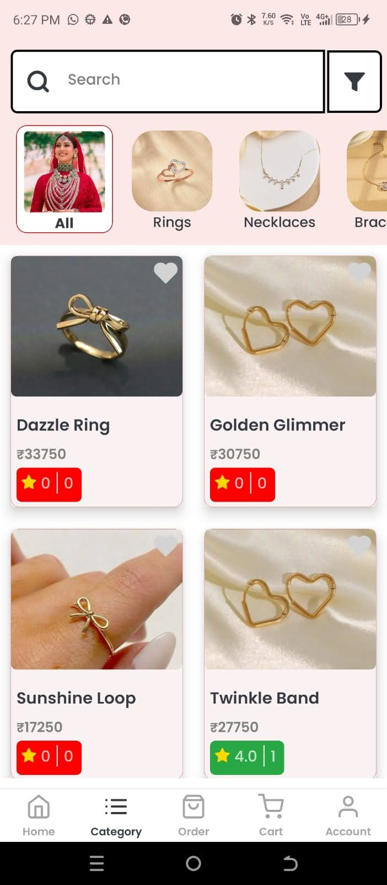 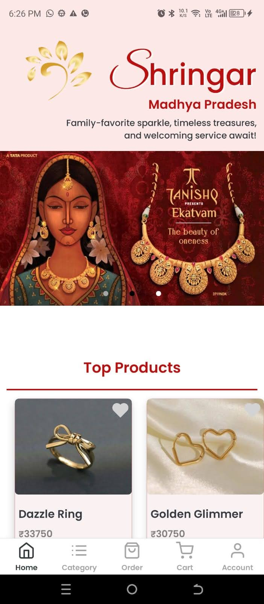  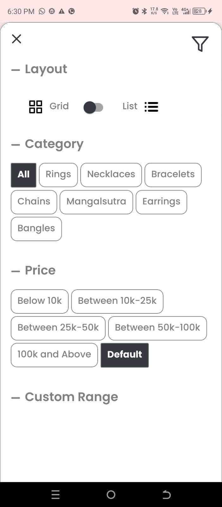 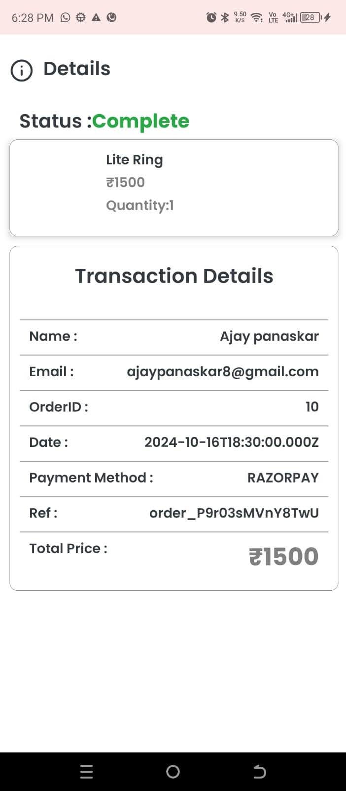 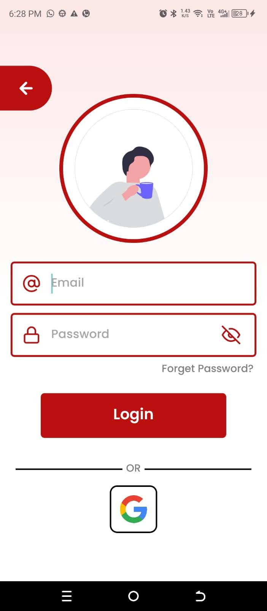 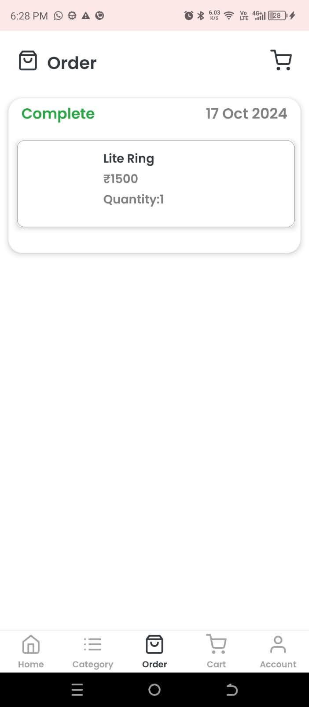 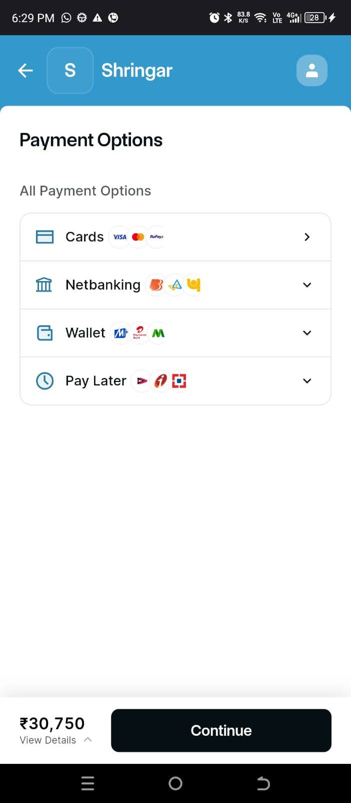 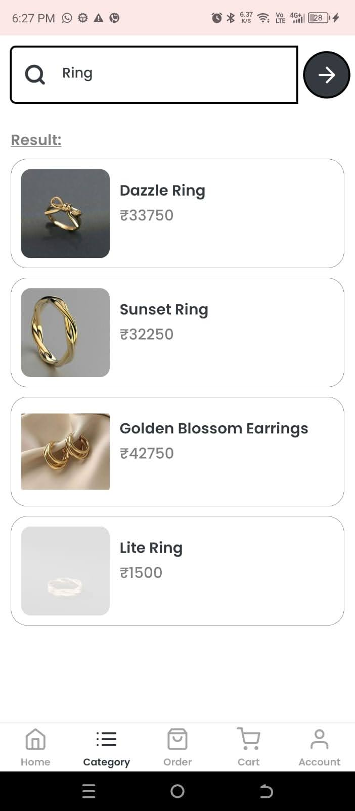 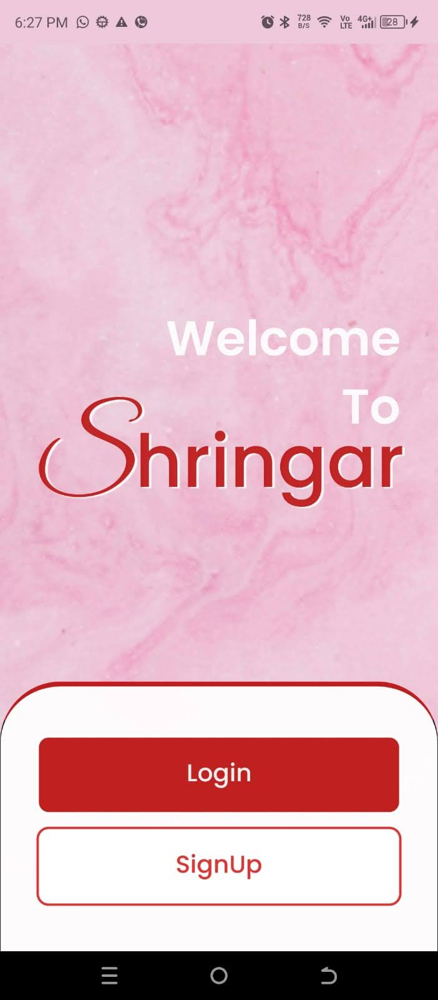 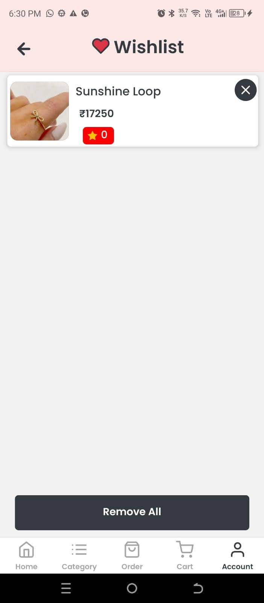 </div>


## Other Modules
For reference, here are links to the other modules of this project:
- **Website:** [Shringar Frontend](https://github.com/Ajay8309/Shringar-Frontend)
- **Admin Panel:** [Shringar Admin Panel](https://github.com/Ajay8309/Admin-panel)

## Backend
The backend for Shringar is private and will not be shared publicly.

## Tech Stack
- **React Native CLI** (Mobile App)
- **React** (Website & Admin Panel)
- **Node.js** (Backend)

## External Libraries
The mobile app leverages several external libraries to ensure smooth functionality and development efficiency, including:
- **React Navigation**
- **Axios**
- **React Native Paper**
- **React Native Razorpay**
- **React Native Maps**
- **React Native Toast Message**
- **React Native Shimmer Placeholder**
- **Date-fns**
- **React Native Linear Gradient**
- **React Native Safe Area Context**
- **React Native Step Indicator**
- **React Native Ratings**
- **React Native Onboarding Swiper**
- **React Native Feather**
- **React Native Progress Steps**
- **Async Storage**

## Installation and Setup
Follow these steps to set up the mobile application locally:

1. **Clone the repository**
   ```bash
   git clone https://github.com/nkit-Pande/Shringar-CLI-Native-Build.git
   cd Shringar-CLI-Native-Build
   ```
2. **Install dependencies**
   ```bash
   npm install
   ```
3. **Run the application**
   - For Android:
     ```bash
     npx react-native run-android
     ```
   - For iOS:
     ```bash
     npx react-native run-ios
     ```

## Acknowledgments
This project was a collaborative effort, and I'd like to acknowledge the contributions of my teammates for the web, admin, and backend modules.

---

If you have any questions or need further assistance, feel free to reach out!

